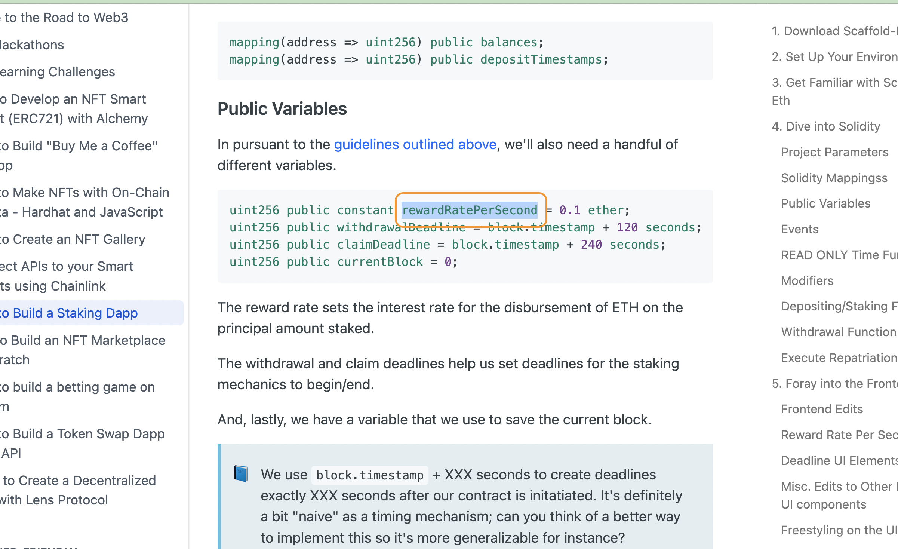

# road_to_web3_week6

We're going to learn:
- [x] - How to use ScaffoldETH to create your DApp front-end in no time
- [x] - How to create a stacking Smart Contract using Solidity
- [x] - Transfer value from smart contracts to wallets and vice versa

### Notes

***THE TUTORIAL PAGE HAS AN ERROR***

Staker.sol file to copy has
```
uint256 public constant rewardRatePerSecond = 0.1 ether;
```

but should be:
```
uint256 public constant rewardRatePerBlock = 0.1 ether;
```

In `App.jsx` you will need to search for `rewardRatePerSecond` and
then replace all occurances with `rewardRatePerBlock`.

Then it should work nicely.




***Steps to work the Dapp:***

- Add funds to Staker contract
- Stake ETH from wallet
- wait for withdraw period to count down
- Withdraw all rewards
- Wait for Claim period to end
- Execute Staker to send remaining ETH to ExampleContract to lock funds


I Added the following to Staker.sol for the challenge:


Added a variable for the multiplier
```
  // Exponential money!!
  uint256 public exponentMultiplier = 2;
```

Updated the withdraw() function to be more explicit in the math.
  Now it exponentially increases by the exponentMultiplier
```
    // get the time passed
    uint256 rewardTime = block.timestamp-depositTimestamps[msg.sender];
    // multiply time passed by exponent
    uint256 rewardsMultiplied = rewardTime**exponentMultiplier;
    // add initial balance to reward rate
    uint256 indBalanceRewards = individualBalance + (rewardsMultiplied*rewardRatePerBlock);
```

Updated the timing variables so i could add a getter and setter type functions later on.
```
  // Set withdrawTime to 120 for 2 minutes by default
  uint256 public withdrawTime = 120;
  uint256 public withdrawalDeadline = block.timestamp + (withdrawTime * 1 seconds);

  // Set claimTime to 240 for 4 minutes by default
  uint256 public claimTime = 240;
  uint256 public claimDeadline = block.timestamp + (claimTime * 1 seconds);
```

Added a whitelist on deploy for the exampleExternalContractAddress
```
    constructor(address exampleExternalContractAddress){
      exampleExternalContract = ExampleExternalContract(exampleExternalContractAddress);
      contractWhitelist = exampleExternalContractAddress;
  }
```

Setup functions added for reset:
```
  /*
  Reset withdrawalDeadline blocktime
  Requires withdrawalDeadlineReached to be true
  */
  function resetWithdrawalDeadline(uint256 _seconds) withdrawalDeadlineReached(true) public {
    require(msg.sender == contractWhitelist, "You are not the exampleExternalContract");
    withdrawalDeadline = block.timestamp + (_seconds * 1 seconds);
  }

  /*
  Reset claimDeadline blocktime
  Requires claimDeadlineReached to be true
  */
  function resetClaimDeadline(uint256 _seconds) claimDeadlineReached(true) public {
    require(msg.sender == contractWhitelist, "You are not the exampleExternalContract");
    claimDeadline = block.timestamp + (_seconds * 1 seconds);
  }
```

On the ExampleContract

Imported the Staker contract
```
import "./Staker.sol";
```

Setup an intance, and then added a setter function
```
Staker public staker;

function setStakerContractAddress(address payable stakerContractAddress) public {
    staker = Staker(stakerContractAddress);
  }

```

I then setup a function to reset the Staker timing via resetStaker()
```
  // Logic to reset Staker contract and send ETH back
  function resetStaker(uint _claimtime, uint256 _withdrawtime) public {
    require(completed = true, "Sorry, cannot run this yet.");
    completed = false;
    // reset timing on Staker contract
    staker.resetWithdrawalDeadline(_withdrawtime);
    staker.resetClaimDeadline(_claimtime);
    // Send contract balance back to Staker contract
    (bool sent, bytes memory data) = address(staker).call{value: address(this).balance}("");
    require(sent, "Failed to send Ether");
  }

```

*** To Reset ***

Set the Staker deployed address

After both claim and withdraw timing is over and executed completed

reset Claim time to 240
reset withdraw time to 120

tada! contract is reset and back to normal.


